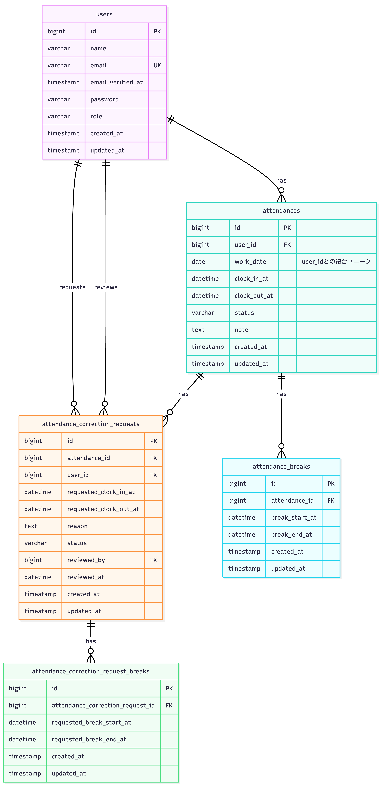

# 勤怠管理アプリ

## 環境構築

### Dockerビルド

1. GitHubからクローン:git clone git@github.com:ArigaAii/coachtech-kintai.git
2. Dockerを起動する:docker-compose up -d --build


### Laravel環境構築

1. PHPコンテナへログイン:docker-compose exec php bash
2. composer install
3. 「.env.example」ファイルから「.env」を作成し、環境変数を変更:cp .env.example .env
4. .envファイルの変更

```
 DB_HOSTをmysqlに変更
 DB_DATABASEをlaravel_dbに変更
 DB_USERNAMEをlaravel_userに変更
 DB_PASSWORDをlaravel_passに変更
 MAIL_FROM_ADDRESSに送信元アドレスを設定
 ```


5. アプリケーションキーの作成:php artisan key:generate
6. マイグレーション実行:php artisan migrate
7. シーディング実行:php artisan db:seed
8. php artisan test

## メール認証

MailHogを使用しています。

会員登録は以下から行います。
http://localhost/register

会員登録後、MailHogに認証メールが送信されます。
認証URLをクリックするとログイン可能になります。
http://localhost:8025


```.env
MAIL_MAILER=smtp
MAIL_HOST=mailhog
MAIL_PORT=1025
MAIL_FROM_ADDRESS=test@example.com
MAIL_FROM_NAME="${APP_NAME}"
```

## テーブル仕様

### usersテーブル

| カラム名 | 型 | primary key | unique key | not null | foreign key |
|---|---|---|---|---|---|
| id | bigint unsigned | ○ |  | ○ |  |
| name | varchar(255) |  |  | ○ |  |
| email | varchar(255) |  | ○ | ○ |  |
| email_verified_at | timestamp |  |  |  |  |
| password | varchar(255) |  |  | ○ |  |
| role | varchar(20) |  |  | ○ |  |
| two_factor_secret | text |  |  |  |  |
| two_factor_recovery_codes | text |  |  |  |  |
| two_factor_confirmed_at | timestamp |  |  |  |  |
| remember_token | varchar(100) |  |  |  |  |
| created_at | timestamp |  |  |  |  |
| updated_at | timestamp |  |  |  |  |

---

### attendancesテーブル

| カラム名 | 型 | primary key | unique key | not null | foreign key |
|---|---|---|---|---|---|
| id | bigint unsigned | ○ |  | ○ |  |
| user_id | bigint unsigned |  | ○ (work_dateとの複合)  | ○ | users(id) |
| work_date | date |  | ○ (user_idとの複合)  | ○ |  |
| clock_in_at | datetime |  |  |  |  |
| clock_out_at | datetime |  |  |  |  |
| status | varchar(20) |  |  | ○ |  |
| note | text |  |  |  |  |
| created_at | timestamp |  |  |  |  |
| updated_at | timestamp |  |  |  |  |

---

### attendance_breaksテーブル

| カラム名 | 型 | primary key | unique key | not null | foreign key |
|---|---|---|---|---|---|
| id | bigint unsigned | ○ |  | ○ |  |
| attendance_id | bigint unsigned |  |  | ○ | attendances(id) |
| break_start_at | datetime |  |  | ○ |  |
| break_end_at | datetime |  |  |  |  |
| created_at | timestamp |  |  |  |  |
| updated_at | timestamp |  |  |  |  |

---

### attendance_correction_requestsテーブル

| カラム名 | 型 | primary key | unique key | not null | foreign key |
|---|---|---|---|---|---|
| id | bigint unsigned | ○ |  | ○ |  |
| attendance_id | bigint unsigned |  |  | ○ | attendances(id) |
| user_id | bigint unsigned |  |  | ○ | users(id) |
| requested_clock_in_at | datetime |  |  |  |  |
| requested_clock_out_at | datetime |  |  |  |  |
| reason | text |  |  | ○ |  |
| status | varchar(20) |  |  | ○ |  |
| reviewed_by | bigint unsigned |  |  |  | users(id) |
| reviewed_at | datetime |  |  |  |  |
| created_at | timestamp |  |  |  |  |
| updated_at | timestamp |  |  |  |  |

---

### attendance_correction_request_breaksテーブル

| カラム名 | 型 | primary key | unique key | not null | foreign key |
|---|---|---|---|---|---|
| id | bigint unsigned | ○ |  | ○ |  |
| attendance_correction_request_id | bigint unsigned |  |  | ○ | attendance_correction_requests(id) |
| requested_break_start_at | datetime |  |  | ○ |  |
| requested_break_end_at | datetime |  |  |  |  |
| created_at | timestamp |  |  |  |  |
| updated_at | timestamp |  |  |  |  |

## ER図




### ログイン情報

管理者
- email：admin@coachtech.com
- password：password

一般ユーザー
- reina.n@coachtech.com / password
- taro.y@coachtech.com / password


## PHPUnitを利用したテストに関して

以下のコマンド：

```bash
//テスト用DB作成
docker-compose exec mysql bash
mysql -u root -p

//パスワードは rootと入力
create database test_database;

docker-compose exec php bash
php artisan migrate:fresh --env=testing
./vendor/bin/phpunit
```


## 機能一覧

### 一般ユーザー
- 会員登録
- ログイン
- ログアウト
- メール認証
- 出勤打刻
- 退勤打刻
- 休憩開始
- 休憩終了
- 勤怠一覧表示
- 勤怠詳細表示
- 勤怠修正申請

### 管理者
- 管理者ログイン
- 全ユーザー勤怠一覧表示
- スタッフ一覧表示
- 勤怠詳細修正
- 修正申請承認


## レスポンシブ対応

PC画面（1400px〜1540px）に対応したレスポンシブデザインを実装し
ています。

## 使用技術（実行環境）

- PHP 8.1.33
- Laravel 8.83.29
- MySQL 8.0.26
- nginx 1.21.1
- Docker/Docker Compose

## URL

- 開発環境： http://localhost/
- phpMyAdmin： http://localhost:8080/
- MailHog： http://localhost:8025/